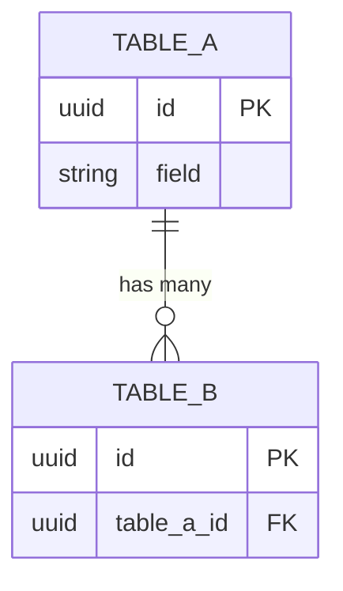

# DB-[FEATURE] — Schema Design for `apps.[app_name]`

<!-- Filename: DB-<FEATURE>-DD-MM-YYYY.md — the workflow-03 output: one comprehensive
     per-feature schema design doc. Copy this template, fill every section, and save it to
     project-management/src/03-DATABASE/. The tables it describes are created in
     code/src/django/apps/<app>/ under Django migrations — never in this folder.
     Remove any section that genuinely does not apply (state why). -->

**Status:** Draft <!-- Draft | Reviewed | Signed off -->
**Date:** DD/MM/YYYY
**Driving story:** US###
**Author:** [name]

---

## Scope & Sources

<!-- What this schema covers, the driving story/epic, and the governing source docs. -->

- **In scope:** [the tables / relationships this design introduces or changes]
- **Out of scope / deferred:** [what is explicitly not covered, and where it lands]
- **Sources:** `code/docs/DATA-STRUCTURES.md` · `code/docs/ENCRYPTION-GUIDE.md` · `code/docs/RLS-GUIDE.md`

## Key Decisions

<!-- The load-bearing modelling choices, chosen vs rejected, with rationale. -->

| Decision  | Choice                    | Rationale |
| --------- | ------------------------- | --------- |
| [PK type] | [UUID / BIGINT]           | [why]     |
| [Tenancy] | [per-client RLS / shared] | [why]     |

## Conventions

<!-- PK strategy, timestamps, soft-delete, naming, enum handling — cite DATA-STRUCTURES.md. -->

- **Primary keys:** [state the rule — e.g. UUID for public/content, BIGINT for auth/operational]
- **Timestamps:** `created_at`, `updated_at` on every table
- **Soft delete / base class:** [abstract base used, if any]

## Tables

<!-- One block per table: purpose, fields (name · type · constraints), indexes, FKs.
     Flag every PII field — each gates to the PII Classification section below. -->

### `[app]_[table]`

[Purpose of the table.]

| Field        | Type             | Constraints / Notes                     |
| ------------ | ---------------- | --------------------------------------- |
| `id`         | UUID / BIGINT PK |                                         |
| `[field]`    | `[type]`         | `[not null / unique / FK → …]` `[PII?]` |
| `created_at` | timestamptz      | auto                                    |
| `updated_at` | timestamptz      | auto                                    |

**Indexes:** [`(field)` for `[query pattern]`]
**Constraints:** [unique / check constraints and the invariant each enforces]

## Cross-App FK Summary

<!-- Every FK that crosses an app boundary, and the consuming direction. -->

| From              | → To              | Relationship        |
| ----------------- | ----------------- | ------------------- |
| `[app_a]_[table]` | `[app_b]_[table]` | [FK, `on_delete=…`] |

## PII Classification (FIELD-ENCRYPTION gate)

<!-- Every personal-data field: classification, Fernet encryption, HMAC lookup companion,
     lawful basis. No PII field ships without an entry here (code/docs/ENCRYPTION-GUIDE.md). -->

| Field             | Classification  | Encrypted (Fernet) | HMAC lookup    | Lawful basis |
| ----------------- | --------------- | ------------------ | -------------- | ------------ |
| `[table].[field]` | [special/basic] | Yes                | `[hmac_token]` | [basis]      |

## RLS & Client Scoping

<!-- Row-level security: tenant variable, per-table policies, and PostgreSQL roles.
     Cite code/docs/RLS-GUIDE.md. -->

- **Tenant variable:** `app.current_[scope]_id`
- **Policies:** [per-table SELECT/INSERT/UPDATE/DELETE scoping]

## IDOR & Enumeration Notes

<!-- How user-supplied IDs are verified against ownership; public identifier exposure. -->

- [Public identifiers exposed as UUID `public_id`, never the sequential PK]
- [Ownership verified before any query on a user-supplied ID]

## Index Strategy Summary

<!-- The indexes added and the query patterns they serve. -->

| Table | Index | Serves |
| ----- | ----- | ------ |
|       |       |        |

## Migration Strategy

<!-- How this reaches the DB. Implementation follows in code/workflows/03-database-migration/. -->

- **New tables:** [list]
- **Data-affecting changes:** [backfill / migration ordering / staging row-count checks]
- **Rollback / no-drop guards:** [any]

## ERD (Mermaid)

<!-- The entity-relationship diagram as Mermaid source. On sign-off, export a rendered
     PNG to ERD-DIAGRAMS/erd-<domain>.png. -->

