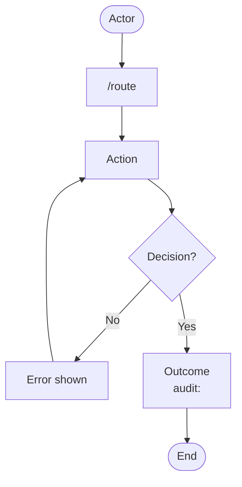
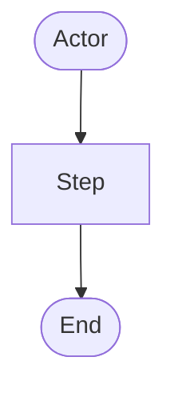

# User Flows — [AREA]

<!-- Filename: USER-FLOW-<AREA>.md — one flow narrative per primary interaction area
     (SCREAMING-SNAKE-CASE area, e.g. USER-FLOW-AUTH.md, USER-FLOW-CHECKOUT.md). Copy this
     template, fill every section, and save it to project-management/src/05-USER-FLOW/.
     Each numbered section documents one screen/journey: narrative + a rendered PNG in
     DIAGRAMS/ + a Mermaid source block. Remove any section that genuinely does not apply
     (state why). A thin flow that belongs to a larger journey becomes a one-line STUB
     instead — see the stub pattern at the foot of this file. -->

[One-paragraph summary of what this area covers — the screens, decisions, and transitions a
user follows through it, and who the actors are.] **Sources:** [US###, US###].

> **Planned routes.** [List any routes that are planned rather than live, with the driving
>
> > story — e.g. `/example/route` is **planned** (US###). Remove this note if every route exists.]

---

## 1. [Screen / Journey Name] (US###)

[Narrative: what the user does on this screen, the decision points, the server-side rules,
and every personal-data touchpoint. Flag each PII touch for the GDPR trace below.]

<!-- Reference the rendered export, then give the Mermaid source it was exported from. -->

---

## 2. [Next Screen / Journey Name] (US###)

<!-- Repeat one numbered section per screen or sub-journey in this area. -->

[Narrative.]

---

## API Design

<!-- Cross-link the Django Ninja operations that back this flow (13-API-DESIGN). Remove if none. -->

| Document                                                                  | Operations                   |
| ------------------------------------------------------------------------- | ---------------------------- |
| [`API-US###-<descriptor>.md`](../13-API-DESIGN/API-US###-<descriptor>.md) | `[operation]`, `[operation]` |

---

## Security Mitigations

<!-- Findings that shape this flow, from 10-SECURITY. Remove if none apply. -->

| Finding | STRIDE        | OWASP | NIST CSF  | Severity       | Threat Summary              | Mitigation                   | Story |
| ------- | ------------- | ----- | --------- | -------------- | --------------------------- | ---------------------------- | ----- |
| UF01    | [S/T/R/I/D/E] | [A0#] | [PR/DE/…] | [HIGH/MED/LOW] | [what an attacker could do] | [the control that closes it] | US### |

---

## GDPR Considerations

<!-- Every flow that touches personal data needs this block (09-GDPR). Remove only if the
     flow handles no personal data at all — and state that explicitly. -->

### Lawful basis

| Processing activity | Lawful basis                  | Article |
| ------------------- | ----------------------------- | ------- |
| [activity]          | [Art. 6(1)(b) — contract / …] | UK GDPR |

### Transparency (Art. 13)

- [Where and how the data subject is told what happens to their data — e.g. a Privacy Policy
  link and lawful-basis statement shown before submission.]

### Security (Art. 32)

- [Token handling, encryption-at-rest, log scrubbing, and other technical safeguards.]

### Audit logging (Art. 5(2))

- [The `audit_auditlog` entries this flow must produce — action + target.]

### Implementation checklist

- [ ] [PII field flagged and classified in 09-GDPR]
- [ ] [Transparency notice shown at the point of collection]
- [ ] [Audit entry written for the key events]

---

## SEO Considerations

<!-- Only for public-facing routes. Classify each route: index or noindex, robots, sitemap.
     Remove this whole section for admin/portal/auth flows that are never indexed. -->

| Route    | noindex Required        | X-Robots-Tag | robots.txt | Sitemap  |
| -------- | ----------------------- | ------------ | ---------- | -------- |
| `/route` | [✅ noindex / ❌ index] | [✅ / —]     | [rule]     | [In/Out] |

---

<!-- ============================================================================
     STUB PATTERN — for a thin flow that belongs to a larger journey.
     Replace the ENTIRE file above with just the block below (delete everything
     else): a title, a one-line pointer to the canonical section, the stories it
     serves, and — optionally — a single high-level Mermaid overview. Never
     duplicate the canonical narrative.

     # User Flows — [AREA]

     [One sentence on the area.] This file is a stub — the canonical flow lives in
     `USER-FLOW-<CANONICAL>.md`.

     > **Canonical source:** `USER-FLOW-<CANONICAL>.md` Section [N] — [Section Name]

     Stories served: US###, US###.
     ============================================================================ -->
